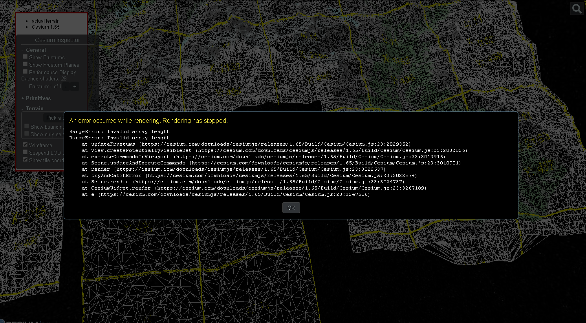
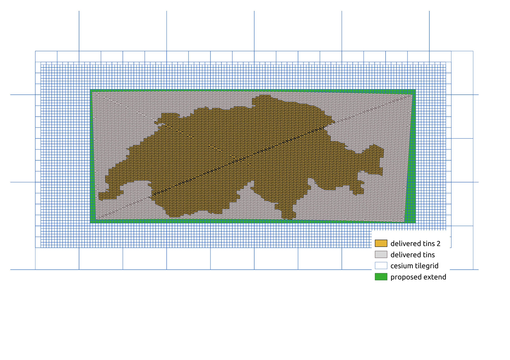

# Update 3D – ein Projekt

Weil es bei neueren Versionen von Cesium.js, ab Version 1.47, beim Darstellen der Cesium Terrain Tiles der swisstopo, zu Fehlern kommt, sollte dieses Verhalten mittels Testdatensätzen genauer betrachtet werden. Die Vorgehensweise und Resultate sind hier wie folgt dokumentiert:


## Testdaten
Da es seitens Topographie zurzeit aufwendig ist, das aktuelle Terrain in TINs abzuleiten (die Datenmenge/Punktwolke ist zurzeit zu gross und zu dicht), wurden künstlich generierte Daten geliefert:


### Test 1

* Viewer: https://codepen.io/rebert/pen/LYEMReZ
* Pfad Tiles: //terrain.dev.bgdi.ch/1.0.0/ch.swisstopo.terrain.3d/default/20190902/4326/
* Cesium Version: 1.65

Damit Cesium an der Schweizergrenze fehlerfrei funktionierte, musste bei den Viewer-Eigenschaften ein Rechteck definiert werden:
`viewer.scene.globe.cartographicLimitRectangle = rectangle;`

Funktioniert einwandfrei.

### Test 2
Ein ausgedünntes künstlich hergestelltes Terrain mit der Höhe 0, nicht rechteckig (gelb Abbildung 2 oben):
* Viewer: https://codepen.io/rebert/pen/bGNOwBv
* Pfad: //terrain.dev.bgdi.ch/1.0.0/ch.swisstopo.terrain.3d/default/20200115/4326/
* Cesium Version: 1.65

Es kommt an der Landesgrenze zum selben Ceslum Fehler wie bei den produktiven Daten.


### Test 3
Die Topographie wollte wissen, ob die Lieferung der TINs auch im Format fbx (anstelle von Shapes) möglich wäre? Zurzeit funktioniert das Werkzeug zur Generierung des Terrains, die 3D-Forge, nur mit Shapes. Und weil die aktuelle OGR Version das fbx Format nicht unterstützt, wäre eine Anpassung des Importes relativ Aufwändig.

### Test mit Einschränkung der aktuellen Terrain Tiles
Wie von Guillaume Beraudo von Camptocamp vermutet hat, führen die Terrain Tiles, die teilweise ohne definierten Werten (NULL, resp. NaN) daherkommen, zu Ceslum.js Fehlern. Diese Tiles befinden sich am Rand der Schweizergrenze.
Schränkt man beim jetzigen produktiven Datensatz den Extend so ein, dass nur Tiles ohne fehlenden Werten erscheinen, funktioniert der Viewer einwandfrei: https://codepen.io/rebert/pen/yLyGaGd

### Herunterladen eines für Cesium > 1.47 korrupten Tiles
```bash
curl 'https://terrain0.geo.admin.ch/1.0.0/ch.swisstopo.terrain.3d/default/20180601/4326/11/2132/1546.terrain?v=1.0.0' -H 'Accept: application/vnd.quantized-mesh,application/octet-stream;q=0.9,*/*;q=0.01' -H 'Referer: http://localhost:8080/Apps/bisect.html' -H 'Origin: http://localhost:8080' -H 'User-Agent: Mozilla/5.0 (X11; Linux x86_64) AppleWebKit/537.36 (KHTML, like Gecko) Ubuntu Chromium/75.0.3770.90 Chrome/75.0.3770.90 Safari/537.36' --compressed > 11_2132_1546.terrain
```

## Ergebnis
Damit Cesium > 1.47 mit unserem momentanen Terrain ohne Hacks im JS-Code direkt funktioniert, muss das Terrain neu generiert werden. Wie von Wobei dieses lückenlos in allen Zoomstufen denselben rechteckigen Extend abdecken muss.
Das Produkt DHM25_EuroDEM beinhaltet beispielsweise Höheninformationen weit über die Landesgrenze hinaus und könnte zum Auffüllen über die Landesgrenze hinaus verwendet werden.

Extend
Die grösse des Rechtecks für die neue Datenlieferung muss noch festgelegt werden:

In WGS84 z.B.:

* ymin: 45.7470703125
* xmin: 5.80078125
* xmax: 11.0302734375
* ymax: 47.900390625

Der hier vorgeschlagene Extend ist in der oberen Abbildung 2 als grünes Rechteck eingezeichnet.

## Aufwand ein neues Terrain zu generieren
### Topographie
Laut Cédric Métraux braucht es ca. 2 Monate, um die Daten auszuliefern. Der grösste Aufwand ergibt sich jedoch, weil die Topographie zurzeit an der Menge von Punktdaten mit Höheninformation (Punktwolke) zu ersticken droht. Nachdem eine vernünftige Ausdünnung gemacht werden konnte, lassen sich die jeweiligen Derivate je Zoomstufe mit Perimeter auch ausserhalb der Landesgrenze ableiten.

### KOGIS
Um den Prozess der Datenbereitstellung zu verkürzen, könnte KOGIS der Topographie ein Laufwerk in der VPC (in der AWS Cloud) zur Verfügung stellen, damit anschliessend ohne Kopiervorgang direkt vom Werkzeug (die 3D-Forge), das das Terrain generiert, gelesen werden könnte.
Bei KOGIS muss sichergestellt werden, dass die 3D-Forge, das die Cesium Terrain Tiles generieren soll, innerhalb von kurzer Zeit in Betrieb genommen werden kann.
Die 3D-Forge wurde vom ehemaligen Mitarbeiter Loïc Gasser entwickelt und das Wissen wurde an Andrea Borghi weitergegeben. Beide arbeiten inzwischen nicht mehr bei der swisstopo. 
Tobias Reber konnte 3D-Forge in Betrieb nehmen und damit Tiles generieren. Aber es konnten noch keine Tiles mit vielen TINS generiert werden, weil der Server auf welchem das Werkzeug läuft, überlastet wird. Hierzu muss der Code noch etwas analysiert und angepasst werden: Der ehemalige Mitarbeiter Loïc Gasser hatte als weitere Möglichkeit, um viele TINs in Cesium Terrain Tiles umzuwandeln, die Amazon Technologie SQS (https://aws.amazon.com/de/sqs/) implementiert. Tobias Reber konnte diesen Teil des Codes jedoch noch nicht zum Laufen bringen. Die Erfahrungen zum Starten des Werkzeugs (3D-forge) sind hier festgehalten: https://github.com/geoadmin/3d-forge/blob/f7e35226855ad91aac44b9480c66d58b139f5f83/TAKEOFF.md
